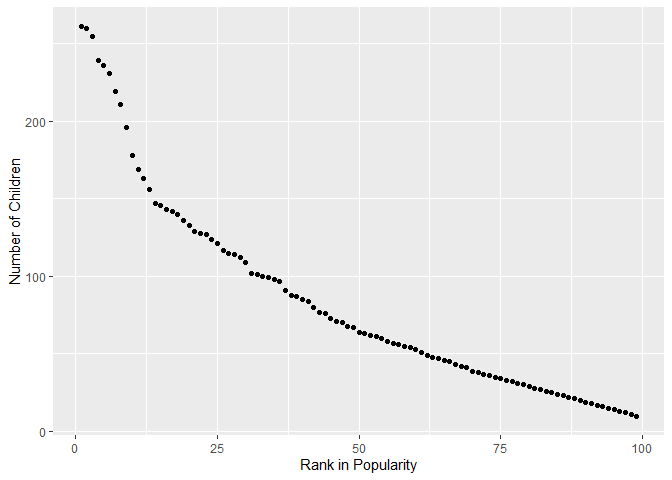

p8105\_hw2\_yq2279
================
Qi Yuchen
9/26/2019

# Problem 1

### Read and clean the Mr. Trash Wheel sheet

``` r
data_trash = 
  read_excel("./data/Trash-Wheel-Collection-Totals-8-6-19.xlsx", sheet = 1, range = "A2:N406") %>% 
  drop_na(Dumpster) %>% 
  janitor::clean_names() %>% 
  mutate(sports_balls = as.integer(round(sports_balls)))
```

    ## Warning in FUN(X[[i]], ...): strings not representable in native encoding
    ## will be translated to UTF-8

``` r
knitr::kable(data_trash[1:10,])
```

| dumpster | month | year | date       | weight\_tons | volume\_cubic\_yards | plastic\_bottles | polystyrene | cigarette\_butts | glass\_bottles | grocery\_bags | chip\_bags | sports\_balls | homes\_powered |
| -------: | :---- | ---: | :--------- | -----------: | -------------------: | ---------------: | ----------: | ---------------: | -------------: | ------------: | ---------: | ------------: | -------------: |
|        1 | May   | 2014 | 2014-05-16 |         4.31 |                   18 |             1450 |        1820 |           126000 |             72 |           584 |       1162 |             7 |              0 |
|        2 | May   | 2014 | 2014-05-16 |         2.74 |                   13 |             1120 |        1030 |            91000 |             42 |           496 |        874 |             5 |              0 |
|        3 | May   | 2014 | 2014-05-16 |         3.45 |                   15 |             2450 |        3100 |           105000 |             50 |          1080 |       2032 |             6 |              0 |
|        4 | May   | 2014 | 2014-05-17 |         3.10 |                   15 |             2380 |        2730 |           100000 |             52 |           896 |       1971 |             6 |              0 |
|        5 | May   | 2014 | 2014-05-17 |         4.06 |                   18 |              980 |         870 |           120000 |             72 |           368 |        753 |             7 |              0 |
|        6 | May   | 2014 | 2014-05-20 |         2.71 |                   13 |             1430 |        2140 |            90000 |             46 |           672 |       1144 |             5 |              0 |
|        7 | May   | 2014 | 2014-05-21 |         1.91 |                    8 |              910 |        1090 |            56000 |             32 |           416 |        692 |             3 |              0 |
|        8 | May   | 2014 | 2014-05-28 |         3.70 |                   16 |             3580 |        4310 |           112000 |             58 |          1552 |       3015 |             6 |              0 |
|        9 | June  | 2014 | 2014-06-05 |         2.52 |                   14 |             2400 |        2790 |            98000 |             49 |           984 |       1988 |             6 |              0 |
|       10 | June  | 2014 | 2014-06-11 |         3.76 |                   18 |             1340 |        1730 |           130000 |             75 |           448 |       1066 |             7 |              0 |

### Read and clean precipitation data for 2017 and 2018

``` r
# read precipitation data for 2017
data_pre2017 = 
  read_excel("./data/Trash-Wheel-Collection-Totals-8-6-19.xlsx", sheet = "2017 Precipitation", range = "A2:B14") %>% 
  drop_na(Total) %>%   # omit rows without precipitation data
  janitor::clean_names() %>% 
  mutate(year = 2017)   # add a variable year

# read precipitation data for 2018
data_pre2018 = 
  read_excel("./data/Trash-Wheel-Collection-Totals-8-6-19.xlsx", sheet = "2018 Precipitation", range = "A2:B14") %>% 
  drop_na(Total) %>%   # omit rows without precipitation data
  janitor::clean_names() %>% 
  mutate(year = 2018)   # add a variable year

# combine precipitation datasets and convert month to a character variable
data_pre2017_2018 = bind_rows(data_pre2017, data_pre2018) %>% 
  mutate(month = month.name[month])

knitr::kable(data_pre2017_2018[1:10,])
```

| month     | total | year |
| :-------- | ----: | ---: |
| January   |  2.34 | 2017 |
| February  |  1.46 | 2017 |
| March     |  3.57 | 2017 |
| April     |  3.99 | 2017 |
| May       |  5.64 | 2017 |
| June      |  1.40 | 2017 |
| July      |  7.09 | 2017 |
| August    |  4.44 | 2017 |
| September |  1.95 | 2017 |
| October   |  0.00 | 2017 |

  - In the data from the Mr. Trash Wheel sheet, the number of
    observations is 344, and the key variables include weight\_tons,
    plastic\_bottles, polystyrene, cigarette\_butts, glass\_bottles,
    sports\_balls, etc.
  - In the combined precipitation data for 2017 and 2018, the number of
    observations is 24, and the key variable is total. The number of
    observations in 2017 and 2018 are 12 and 12 respectively, and the
    key variable is total in both.
  - The total precipitation in 2018 is 70.33.
  - The median number of sports balls in a dumpster in 2017 is 8.

# Problem 2

### clean the data in pols-month.csv

``` r
data_pols_month = read_csv("./data/pols-month.csv") %>%
  janitor::clean_names() %>%
  separate(mon, into = c("year", "month", "day"), sep = "-") %>% 
  mutate(month = month.name[as.numeric(month)]) %>% 
  pivot_longer(cols = starts_with("prez"),
               names_to = "president",
               names_prefix = "prez_") %>%
  filter(value != 0) %>% 
  select(-value) %>% 
  select(-day)
```

    ## Parsed with column specification:
    ## cols(
    ##   mon = col_date(format = ""),
    ##   prez_gop = col_double(),
    ##   gov_gop = col_double(),
    ##   sen_gop = col_double(),
    ##   rep_gop = col_double(),
    ##   prez_dem = col_double(),
    ##   gov_dem = col_double(),
    ##   sen_dem = col_double(),
    ##   rep_dem = col_double()
    ## )

``` r
knitr::kable(data_pols_month[1:10,])
```

| year | month     | gov\_gop | sen\_gop | rep\_gop | gov\_dem | sen\_dem | rep\_dem | president |
| :--- | :-------- | -------: | -------: | -------: | -------: | -------: | -------: | :-------- |
| 1947 | January   |       23 |       51 |      253 |       23 |       45 |      198 | dem       |
| 1947 | February  |       23 |       51 |      253 |       23 |       45 |      198 | dem       |
| 1947 | March     |       23 |       51 |      253 |       23 |       45 |      198 | dem       |
| 1947 | April     |       23 |       51 |      253 |       23 |       45 |      198 | dem       |
| 1947 | May       |       23 |       51 |      253 |       23 |       45 |      198 | dem       |
| 1947 | June      |       23 |       51 |      253 |       23 |       45 |      198 | dem       |
| 1947 | July      |       23 |       51 |      253 |       23 |       45 |      198 | dem       |
| 1947 | August    |       23 |       51 |      253 |       23 |       45 |      198 | dem       |
| 1947 | September |       23 |       51 |      253 |       23 |       45 |      198 | dem       |
| 1947 | October   |       23 |       51 |      253 |       23 |       45 |      198 | dem       |

### Clean the data in snp.csv

``` r
data_snp = read_csv("./data/snp.csv") %>%
  janitor::clean_names() %>%
  separate(date, into = c("month", "day", "year"), sep = "/") %>%
  mutate(year = as.numeric(year), month = as.numeric(month)) %>% 
  arrange(year, month) %>%
  mutate(month = month.name[month]) %>%
  select(year, month, everything()) %>% 
  select(-day) %>% 
  mutate(year = as.character(year))
```

    ## Parsed with column specification:
    ## cols(
    ##   date = col_character(),
    ##   close = col_double()
    ## )

``` r
knitr::kable(data_snp[1:10,])
```

| year | month     | close |
| :--- | :-------- | ----: |
| 1950 | January   | 17.05 |
| 1950 | February  | 17.22 |
| 1950 | March     | 17.29 |
| 1950 | April     | 17.96 |
| 1950 | May       | 18.78 |
| 1950 | June      | 17.69 |
| 1950 | July      | 17.84 |
| 1950 | August    | 18.42 |
| 1950 | September | 19.45 |
| 1950 | October   | 19.53 |

### Tidy the unemployment data

``` r
data_unemployment = read_csv("./data/unemployment.csv") %>%
  janitor::clean_names() %>%
  pivot_longer(cols = jan:dec,
               names_to = "month",
               values_to = "unemployment") %>%
  arrange(year, month) %>%
  mutate(month = month.name[factor(month)]) %>% 
  mutate(year = as.character(year))
```

    ## Parsed with column specification:
    ## cols(
    ##   Year = col_double(),
    ##   Jan = col_double(),
    ##   Feb = col_double(),
    ##   Mar = col_double(),
    ##   Apr = col_double(),
    ##   May = col_double(),
    ##   Jun = col_double(),
    ##   Jul = col_double(),
    ##   Aug = col_double(),
    ##   Sep = col_double(),
    ##   Oct = col_double(),
    ##   Nov = col_double(),
    ##   Dec = col_double()
    ## )

``` r
knitr::kable(data_unemployment[1:10,])
```

| year | month     | unemployment |
| :--- | :-------- | -----------: |
| 1948 | January   |          3.9 |
| 1948 | February  |          3.9 |
| 1948 | March     |          4.0 |
| 1948 | April     |          3.8 |
| 1948 | May       |          3.4 |
| 1948 | June      |          3.6 |
| 1948 | July      |          3.6 |
| 1948 | August    |          4.0 |
| 1948 | September |          3.5 |
| 1948 | October   |          3.8 |

### Join the datasets by merging snp into pols, and merging unemployment into the result

``` r
pols_snp_unemployment = left_join(data_pols_month, data_snp, by = c("year", "month")) %>% 
  left_join(data_unemployment, by = c("year", "month"))

knitr::kable(pols_snp_unemployment[1:10,])
```

| year | month     | gov\_gop | sen\_gop | rep\_gop | gov\_dem | sen\_dem | rep\_dem | president | close | unemployment |
| :--- | :-------- | -------: | -------: | -------: | -------: | -------: | -------: | :-------- | ----: | -----------: |
| 1947 | January   |       23 |       51 |      253 |       23 |       45 |      198 | dem       |    NA |           NA |
| 1947 | February  |       23 |       51 |      253 |       23 |       45 |      198 | dem       |    NA |           NA |
| 1947 | March     |       23 |       51 |      253 |       23 |       45 |      198 | dem       |    NA |           NA |
| 1947 | April     |       23 |       51 |      253 |       23 |       45 |      198 | dem       |    NA |           NA |
| 1947 | May       |       23 |       51 |      253 |       23 |       45 |      198 | dem       |    NA |           NA |
| 1947 | June      |       23 |       51 |      253 |       23 |       45 |      198 | dem       |    NA |           NA |
| 1947 | July      |       23 |       51 |      253 |       23 |       45 |      198 | dem       |    NA |           NA |
| 1947 | August    |       23 |       51 |      253 |       23 |       45 |      198 | dem       |    NA |           NA |
| 1947 | September |       23 |       51 |      253 |       23 |       45 |      198 | dem       |    NA |           NA |
| 1947 | October   |       23 |       51 |      253 |       23 |       45 |      198 | dem       |    NA |           NA |

  - In data\_pols\_month, the number of observations is 822 and there
    are 9 variables. The range of year is from 1947 to 2015. The key
    variables are gov\_gop, sen\_gop, rep\_gop, gov\_dem, sen\_dem,
    rep\_dem, president.
  - In data\_snp, the number of observations is 787 and there are 3
    variables. The range of year is from 1950 to 2015. The key variable
    is close.
  - In data\_unemployment, the number of observations is 816 and there
    are 3 variables. The range of year is from 1948 to 2015. The key
    variable is unemployment.
  - In the joint dataset pols\_snp\_unemployment, the number of
    observations is 822 and there are 11 variables. The range of year is
    from 1947 to 2015. The key variables are gov\_gop, sen\_gop,
    rep\_gop, gov\_dem, sen\_dem, rep\_dem, president, close,
    unemployment.

# Question 3

### Load and tidy the data on the popularity of baby names

``` r
data_baby_names = read_csv("./data/Popular_Baby_Names.csv") %>% 
  janitor::clean_names() %>%
  mutate(
    ethnicity = recode(ethnicity, 
                       "ASIAN AND PACI" = "ASIAN AND PACIFIC ISLANDER",
                       "BLACK NON HISP" = "BLACK NON HISPANIC",
                       "WHITE NON HISP" = "WHITE NON HISPANIC"),
    ethnicity = str_to_lower(ethnicity)
    ) %>% 
  mutate(
    childs_first_name = str_to_title(childs_first_name),
    gender = str_to_lower(gender)
    ) %>% 
  distinct()
```

    ## Parsed with column specification:
    ## cols(
    ##   `Year of Birth` = col_double(),
    ##   Gender = col_character(),
    ##   Ethnicity = col_character(),
    ##   `Child's First Name` = col_character(),
    ##   Count = col_double(),
    ##   Rank = col_double()
    ## )

### Produce a table showing the rank of “Olivia”

``` r
data_Olivia = 
  filter(data_baby_names, gender == "female" & childs_first_name == "Olivia") %>% 
  pivot_wider(
    names_from = "year_of_birth",
    values_from = "rank",
    id_cols = ethnicity
    )

knitr::kable(data_Olivia)
```

| ethnicity                  | 2016 | 2015 | 2014 | 2013 | 2012 | 2011 |
| :------------------------- | ---: | ---: | ---: | ---: | ---: | ---: |
| asian and pacific islander |    1 |    1 |    1 |    3 |    3 |    4 |
| black non hispanic         |    8 |    4 |    8 |    6 |    8 |   10 |
| hispanic                   |   13 |   16 |   16 |   22 |   22 |   18 |
| white non hispanic         |    1 |    1 |    1 |    1 |    4 |    2 |

### Produce a table showing the most popular male name

``` r
data_male = 
  filter(data_baby_names, gender == "male" & rank == 1) %>%
  pivot_wider(
    names_from = "year_of_birth",
    values_from = "childs_first_name",
    id_cols = ethnicity
    )

knitr::kable(data_male)
```

| ethnicity                  | 2016   | 2015   | 2014   | 2013   | 2012   | 2011    |
| :------------------------- | :----- | :----- | :----- | :----- | :----- | :------ |
| asian and pacific islander | Ethan  | Jayden | Jayden | Jayden | Ryan   | Ethan   |
| black non hispanic         | Noah   | Noah   | Ethan  | Ethan  | Jayden | Jayden  |
| hispanic                   | Liam   | Liam   | Liam   | Jayden | Jayden | Jayden  |
| white non hispanic         | Joseph | David  | Joseph | David  | Joseph | Michael |

### Produce a scatter plot about male white non-hispanic children born in 2016

``` r
data_plot = filter(data_baby_names, 
                   gender == "male" & 
                   ethnicity == "white non hispanic" & 
                   year_of_birth == 2016)
ggplot(data_plot, aes(x = rank, y = count)) +
  geom_point() +
  xlab("Rank in Popularity") +
  ylab("Number of Children") 
```

<!-- -->
